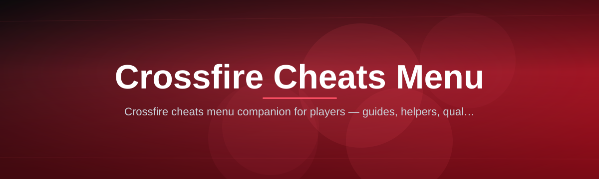

  
  
  

  

  
  
  

---

Loading a full Crossfire loadout menu shouldn't feel like assembling furniture with no manual — this repo packages 35 modules into one launcher so you click, load, and play. Detection status, update cadence, and safety notes are all covered further down — **see FAQ for detection/updates** before your first session.

---

## 📜 Table of Contents

- [📦 Installation — Getting the Menu Running](#-installation--getting-the-menu-running)
- [🧩 All Modules Status](#-all-modules-status)
- [🎯 The Problem With Most Crossfire Cheat Menus](#-the-problem-with-most-crossfire-cheat-menus)
- [🗂️ Grouped Module Catalog](#-grouped-module-catalog)
- [📋 Usage Guidelines](#-usage-guidelines)
- [🧾 FAQ](#-faq)
- [🧠 Tips for Best Results](#-tips-for-best-results)
- [📖 What Is a Crossfire Cheat Menu?](#-what-is-a-crossfire-cheat-menu)
- [🗺️ Overview](#-overview)
- [🧯 Known Issues](#-known-issues)
- [🏁 Closing Notes](#-closing-notes)

---

## 📦 Installation — Getting the Menu Running

**No client, no package manager, no compiling** — this is a straight extract-and-launch tool.

1. **Grab the archive** — open the project page and pull the latest packaged build.
2. **Extract to a clean folder** — unzip anywhere outside `Program Files` (permission issues live there).
3. **Whitelist the folder** — add the extracted directory to your antivirus exclusions so files aren't quarantined mid-load.
4. **Run the launcher** — start the `.exe`, let the module list populate, then hit Inject.
5. **Launch Crossfire** — start the game after the menu confirms a green "attached" status.

  

Run the `.exe` as Administrator on the first launch only — it needs elevated rights to hook into the game process once, then subsequent runs work normally.

---

## 🧩 All Modules Status

| Module | Status | Description |
|---|---|---|
| Silent Aim | ✅ Working | Locks hits to target hitbox without visible crosshair snap |
| Player ESP Boxes | ✅ Working | Draws boxes on enemies through walls and smoke |
| Bunny Hop Assist | ✅ Working | Auto-repeats jump timing for consistent hop chains |
| Recoil Compensation | ✅ Working | Cancels vertical/horizontal spray pattern per weapon |
| Weapon Skin Swapper | ✅ Working | Forces custom skin render client-side |
| Radar Zoom Control | ✅ Working | Expands minimap radius beyond default game limit |
| Signature Randomizer | ✅ Working | Rotates memory signature on each session start |
| Auto Plant/Defuse Timer | ✅ Working | Displays countdown overlay for bomb objectives |
| Smoke Penetration Vision | 🟡 Beta | Renders players inside smoke with reduced opacity |
| No Fall Damage | ✅ Working | Removes fall damage calculation on landing |
| Custom Crosshair Pack | ✅ Working | Swaps in-game reticle for high-contrast alternatives |
| Config Auto-Cleaner | ✅ Working | Wipes temp injection logs after each session |

---

## 🎯 The Problem With Most Crossfire Cheat Menus

- Bundled loaders that inject five things you never asked for and slow the game to a crawl.
- Aimbots with zero smoothing settings — instant snap that gets reported in the first round.
- ESP boxes that flicker or desync from hitboxes after a patch, giving away nothing but your position.
- Menus that hardcode hotkeys, colliding with default Crossfire binds like `B` for buy menu.
- Zero visibility into what's actually running — no module list, no status, just a black box process.
- Update lag — a patch drops and the "cheat" silently breaks instead of telling you it's outdated.
- Config files scattered across the game directory, easy for anti-cheat scans to flag on sight.

---

## 🗂️ Grouped Module Catalog

### 🔫 Aimbot & Combat Suite

Combat assistance here is built around adjustable behavior rather than a single on/off switch — every targeting module exposes sliders so your aim looks like *your* aim, just faster and steadier.

- **Silent Aim** — registers hits on target bone without rotating your visible view.
- **Auto Trigger** — fires the instant crosshair crosses a hitbox, tunable by reaction delay.
- **Smooth Aim Curve** — interpolates flick speed so tracking reads as human movement.
- **Recoil Compensation** — offsets spray pattern per weapon profile automatically.
- **Bone Priority Selector** — choose head, chest, or nearest-visible as the lock target.
- **FOV-Limited Targeting** — restricts lock radius to a configurable cone in front of your view.
- **Auto Fire Burst Control** — caps automatic fire into short bursts to mimic manual tapping.

### 👁️ Wallhack & Vision Systems

Vision modules read entity data client-side and render it as overlays — nothing touches server-side hit registration, so this layer stays purely informational.

- **Player ESP Boxes** — draws bounding boxes on enemies through geometry.
- **Skeleton Wireframe** — renders bone structure for precise pre-aim positioning.
- **Distance Tags** — shows meter distance floating above each visible enemy box.
- **Weapon ESP** — labels the weapon an enemy is currently holding.
- **Explosive/Grenade Radar** — pings thrown grenades on the minimap before detonation.
- **Smoke Penetration Vision** — silhouettes players standing inside active smoke clouds.

### 🏃 Movement & Utility Tools

These aren't combat modules — they smooth out movement mechanics and match-flow friction that eat rounds.

- **Bunny Hop Assist** — auto-times jump inputs for a continuous hop chain.
- **No Fall Damage** — removes drop-damage calculation entirely.
- **Speed Adjust Slider** — nudges movement speed multiplier within a safe range.
- **Auto Plant/Defuse Timer** — overlays a countdown during bomb objective phases.
- **Ping Spike Stabilizer** — smooths displayed ping during network jitter.
- **Quick Peek Macro** — binds a single key to lean-peek-and-retreat around cover.

### 🖥️ Visual & HUD Overlays

Everything in this category is cosmetic-layer only — it changes what you see on screen, not how the game engine behaves underneath.

- **Custom Crosshair Pack** — replaces default reticle with high-visibility variants.
- **Kill Feed Enhancer** — enlarges and recolors kill feed entries for faster reads.
- **Radar Zoom Control** — extends minimap detection radius beyond default.
- **Damage Indicator Overlay** — flashes directional markers when you take damage.
- **FPS & Ping Counter** — pins a lightweight performance readout to the corner.
- **Minimal HUD Mode** — strips non-essential UI clutter during ranked matches.

### 🎨 Skins & Customization

Purely visual swaps rendered on your client — teammates and enemies see standard models, only you see the customization.

- **Weapon Skin Swapper** — forces a chosen skin render on any equipped weapon.
- **Knife Skin Changer** — cycles knife skins independent of inventory ownership.
- **Killstreak Sound Pack** — replaces default kill sounds with alternate audio sets.
- **Custom Crosshair Colors** — recolors the reticle to any RGB value you set.
- **Menu Theme Selector** — switches the cheat menu's own UI skin between presets.

### 🕵️ Anti-Detection & Safety

Safety modules run quietly in the background and don't require any manual tuning per session.

- **Signature Randomizer** — rotates the injection signature on every launch.
- **Process Hider** — masks the running process from casual task-manager checks.
- **Config Auto-Cleaner** — deletes temp logs and cache after each session ends.
- **Cooldown Scheduler** — enforces spaced play sessions to avoid pattern flags.
- **Safe Mode Toggle** — disables the aggressive modules, keeping ESP-only for lower-risk play.

---

## 📋 Usage Guidelines

| Allowed | Not Allowed |
|---|---|
| Running the menu in unranked or private lobbies | Using Silent Aim or Auto Trigger in ranked competitive queues |
| Testing modules solo before a live match | Streaming with visible ESP boxes on a public broadcast |
| Adjusting sliders to keep movement natural | Maxing every combat module at once in a public server |
| Using Safe Mode for casual sessions | Sharing your config file publicly with identifying data |
| Updating before each patch day | Running two injection tools into the same process simultaneously |

---

## 🧾 FAQ

Is this safe to run on Crossfire?

No cheat tool is ever 100% risk-free. Anti-Detection modules reduce common flags, but ranked queues carry the highest exposure — Safe Mode exists specifically to lower that risk.

How often does the menu get updated?

Patches typically land within 24–72 hours of a Crossfire client update. The launcher shows a version mismatch warning if your build is outdated.

Does it work on the Steam release of Crossfire?

Yes, the injector attaches to both the standalone client and the Steam-distributed build — process detection is automatic on launch.

Do I need Administrator rights every time?

Only on first run for the initial hook. After that, standard user permissions are enough for regular sessions.

Will this get my account banned?

Combat modules like Silent Aim carry the highest ban risk in ranked play. ESP-only or Safe Mode sessions in casual lobbies carry noticeably lower reported risk.

Can I use custom skins without owning them in-game?

Yes — the Skin Swapper renders client-side only, so it doesn't require inventory ownership, but other players never see the swapped skin.

Why did the menu fail to attach?

Usually an antivirus quarantine or a Crossfire patch that shifted memory offsets. Check the exclusions folder first, then confirm you're on the latest menu build.

Does Recoil Compensation work on every weapon?

Weapon profiles are added per patch cycle — most primary rifles and SMGs are covered at launch, with new profiles added as reported.

Can I run this alongside other overlay software like Discord?

Yes, standard overlays (Discord, FPS counters) don't conflict. Avoid running alongside other injection-based tools targeting the same process.

Is there a way to restore default settings?

Deleting the local config folder and relaunching regenerates default values for every module automatically.

---

## 🧠 Tips for Best Results

- Start every session in Safe Mode, then enable individual modules once the menu confirms a stable attach.
- Keep Smooth Aim Curve above the halfway mark — raw snap settings are the fastest way to draw reports.
- Run Config Auto-Cleaner after each session, especially before switching between ranked and casual queues.
- Update the menu before opening Crossfire on patch days — mismatched versions cause the most attach failures.
- Pair Distance Tags with Skeleton Wireframe sparingly; both active at once can clutter the screen at long range.
- Test any new module in a private lobby first before trusting it in a live match.

---

## 📖 What Is a Crossfire Cheat Menu?

| Term | Explanation |
|---|---|
| Aimbot | Automated targeting assist that locks or nudges aim toward an enemy hitbox |
| ESP (Extra Sensory Perception) | Overlay rendering that shows enemy position/info through obstacles |
| Wallhack | Vision module that reveals players or objects hidden behind geometry |
| No Recoil | Compensation logic that cancels a weapon's spray pattern in real time |
| Trigger Bot | Sub-module of aimbot that fires automatically once crosshair meets a target |
| Injection | Process of loading the menu's code into the running game client |
| Safe Mode | Configuration preset that disables high-risk combat modules |

A cheat menu like this one bundles targeting, vision, movement, and cosmetic modules behind a single control panel instead of forcing separate standalone tools. Benefits worth noting: one launcher instead of five scripts, live module status instead of guesswork, adjustable sliders instead of fixed snap-aim, and a Safe Mode preset for lower-risk casual play.

---

## 🗺️ Overview

| Category | Details |
|---|---|
| Total Modules | 35 across six domain categories |
| Core Focus | Combat, vision, movement, HUD, skins, safety |
| Distribution | Landing page download → extract → run, no installer chain |
| Update Cycle | Patched within 24–72 hours of client updates |
| Supported Builds | Standalone client + Steam-distributed release |
| Config Storage | Local folder, cleared automatically post-session |

The menu is built as a single control panel rather than a scattered collection of scripts — every module reports its own status line so you know exactly what's active before a round starts, and Safe Mode gives a lower-risk fallback for casual play without disabling vision utilities entirely.

---

## 🧯 Known Issues

| Issue | Fix |
|---|---|
| Menu fails to attach after a Crossfire patch | Update to the latest build before relaunching Crossfire |
| Antivirus quarantines the `.exe` on extraction | Add the extracted folder to exclusions before running |
| ESP boxes flicker at long draw distance | Lower Skeleton Wireframe

  

